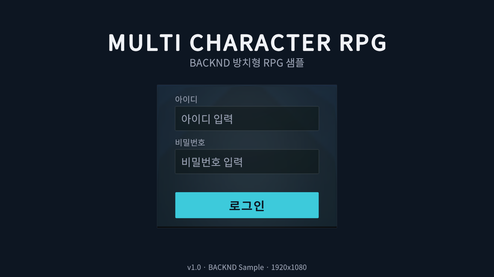
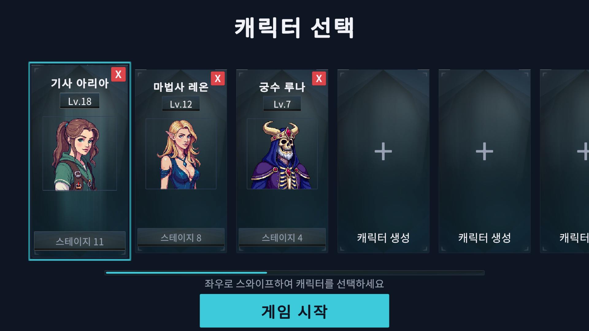
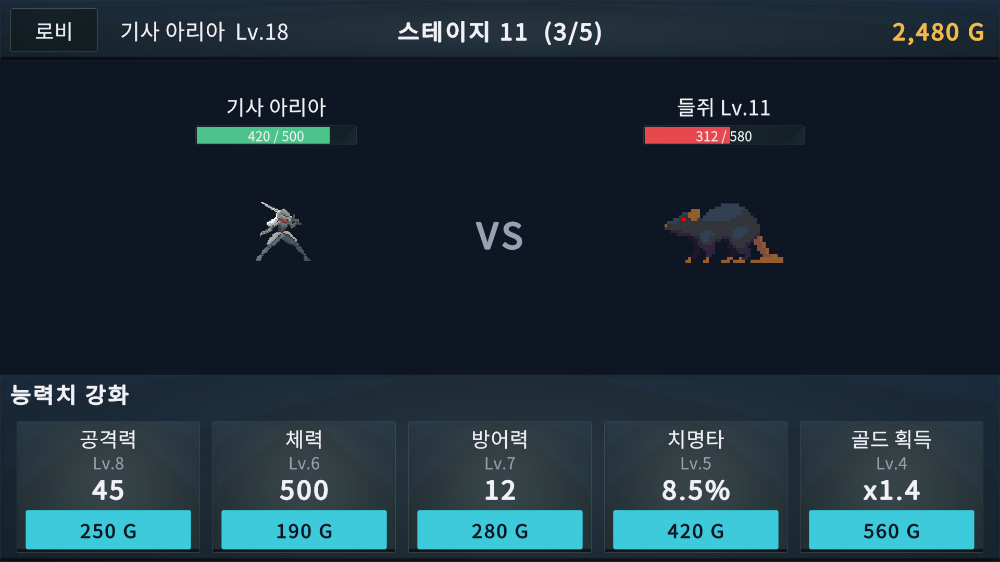
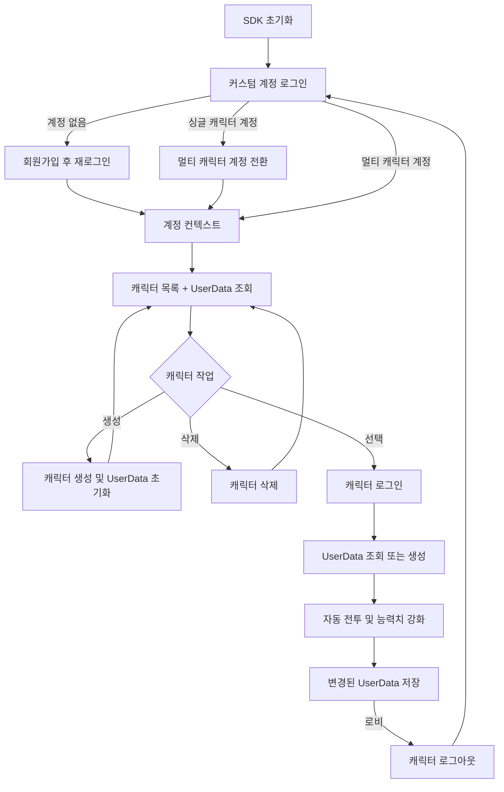

# BACKND 멀티 캐릭터 + 게임 정보 샘플

Unity에서 [뒤끝(BACKND) 멀티 캐릭터](https://docs.backnd.com/sdk-docs/backend/base/user/multi-character/what-is-multi-character/) 로그인과 캐릭터별 게임 정보 저장 흐름을 확인하는 샘플 프로젝트입니다.

하나의 계정으로 로그인한 뒤 캐릭터를 생성·선택·삭제하고, 선택한 캐릭터의 `UserData`를 불러와 방치형 RPG를 진행합니다. 전투 보상과 능력치 강화 결과는 캐릭터별 데이터로 저장됩니다.

## 스크린샷

### 계정 로그인



존재하지 않는 커스텀 계정으로 로그인하면 회원가입 후 다시 로그인합니다. 싱글 캐릭터 계정으로 판별되면 같은 계정 정보로 멀티 캐릭터 계정 전환을 진행할 수 있습니다.

### 캐릭터 선택



뒤끝 멀티 캐릭터는 계정당 캐릭터를 최대 20개까지 생성할 수 있습니다. 샘플 UI는 서버 제한보다 1개 많은 21개 슬롯으로 구성해, 마지막 슬롯에서 생성을 시도하면 서버가 반환하는 제한 응답을 그대로 확인할 수 있습니다. 좌우 스와이프로 전체 슬롯을 확인할 수 있습니다.

### 방치형 RPG



자동 전투로 골드를 획득하고 공격력, 체력, 방어력, 치명타, 골드 획득량을 강화합니다.

## 주요 기능

- 커스텀 계정 로그인 및 미가입 계정 자동 회원가입
- 싱글 캐릭터 계정의 멀티 캐릭터 계정 전환
- 계정에 속한 캐릭터 목록과 `UserData` 동시 조회
- 캐릭터 생성, 선택, 삭제와 서버 생성 제한(최대 20개) 응답 처리
- 캐릭터별 게임 정보 조회, 신규 생성, 갱신
- 자동 전투, 스테이지 진행, 골드 보상, 능력치 강화
- 5분 주기, 로비 이동, 백그라운드 전환, 지원 플랫폼의 애플리케이션 종료 시 저장

## 실행 환경

| 항목 | 버전/구성 |
| --- | --- |
| Unity | `2022.3.62f3` |
| 뒤끝 SDK | `5.18.14` (`Assets/TheBackend`에 포함) |
| UI | uGUI, TextMesh Pro `3.0.9` |
| 기본 씬 | `Assets/Scenes/SampleScene.unity` |
| 게임 정보 테이블 | `UserData` |

## 시작하기

### 1. 뒤끝 프로젝트 준비

[뒤끝 콘솔](https://console.thebackend.io/)에서 멀티 캐릭터 기능을 사용할 수 있는 프로젝트를 준비합니다. 일반 프로젝트 키를 사용하면 로그인 화면에 `싱글 캐릭터 프로젝트입니다. 멀티 캐릭터 프로젝트 키로 변경하세요.`가 표시됩니다.

### 2. `UserData` 테이블 생성

뒤끝 콘솔의 게임 정보 관리에서 다음 이름으로 테이블을 생성합니다.

```text
UserData
```

샘플은 아래 필드를 저장하므로 스키마를 정의하지 않는 테이블로 생성하거나 동일한 필드를 허용해야 합니다. 테이블 이름은 코드의 `CharacterRepository.TableName`과 대소문자까지 일치해야 합니다.

| 필드 | 형식 | 초기값 | 설명 |
| --- | --- | ---: | --- |
| `portraitIndex` | number | 선택한 초상화 | 캐릭터 카드 초상화 인덱스 |
| `stage` | number | `1` | 진행 스테이지 |
| `killsInStage` | number | `0` | 현재 스테이지 처치 수 |
| `gold` | number | `200` | 보유 골드 |
| `attackLevel` | number | `1` | 공격력 강화 레벨 |
| `healthLevel` | number | `1` | 체력 강화 레벨 |
| `defenseLevel` | number | `1` | 방어력 강화 레벨 |
| `critLevel` | number | `1` | 치명타 강화 레벨 |
| `goldGainLevel` | number | `1` | 골드 획득 강화 레벨 |

### 3. Unity에 프로젝트 키 입력

1. Unity에서 프로젝트를 엽니다.
2. `The Backend > Edit Settings`를 선택합니다.
3. 사용할 뒤끝 프로젝트의 Client App ID와 Signature Key를 입력합니다.
4. `Assets/Scenes/SampleScene.unity`를 열고 Play Mode를 실행합니다.

## 사용 흐름



뒤끝 Base 기능은 캐릭터를 선택한 뒤 사용할 수 있습니다. 샘플은 캐릭터 컨텍스트에서 게임 정보를 저장하고, 로비로 돌아갈 때 캐릭터 로그아웃 후 보관 중인 계정 정보로 다시 로그인합니다.

## 핵심 함수

모든 비동기 SDK 호출은 콜백 결과를 기다리는 코루틴으로 감쌌습니다. 구현은 [`CharacterRepository.cs`](./Assets/Scripts/Data/CharacterRepository.cs)에 모여 있습니다.

표에서는 화면 폭을 줄이기 위해 `Backend`와 하위 클래스 접두어를 생략했습니다.

| 샘플 함수 | 기능 및 호출 SDK |
| --- | --- |
| `LoginOrRegister` | SDK를 초기화하고 계정에 로그인합니다. `401 bad customId`일 때만 회원가입 후 재로그인합니다.<br>**SDK:** `InitializeAsync`<br>`CustomLogin`<br>`CustomSignUp` |
| <code>ElevateTo<wbr>MultiCharacter</code> | 로그인된 싱글 캐릭터 계정을 멀티 캐릭터 계정으로 전환합니다.<br>**SDK:** `Elevate` |
| `LoadCharacters` | 캐릭터 목록과 각 캐릭터의 `UserData`를 함께 조회합니다. 위치 정보 조회 실패 시 샘플 기본값을 적용합니다.<br>**SDK:** <code>UpdateLocation<wbr>Properties</code><br><code>CustomizeLocation<wbr>Properties</code>(조회 실패 시)<br>`GetCharacterList` |
| `CreateCharacter` | 캐릭터를 생성·선택하고 초기 `UserData`를 삽입한 뒤 계정 컨텍스트로 복귀합니다. 생성 실패는 상태 코드로 구분해 `403`은 서버 생성 제한, `409`는 이름 중복으로 안내합니다.<br>**SDK:** `CreateCharacter`<br>`SelectCharacter`<br>`Insert` |
| `DeleteCharacter` | `uuid`와 `inDate`로 캐릭터를 영구 삭제합니다.<br>**SDK:** `DeleteCharacter` |
| <code>SelectAndLoad<wbr>Character</code> | 캐릭터로 로그인하고 `UserData`를 조회합니다. 데이터 행이 없으면 초기값을 삽입합니다.<br>**SDK:** `SelectCharacter`<br>`GetMyData`<br>`Insert` |
| `MarkDirty` | 전투 보상이나 강화로 데이터가 바뀌었음을 revision 값으로 기록합니다.<br>**SDK:** 호출 없음 |
| `SaveSelected` | 변경된 선택 캐릭터만 저장합니다. 저장 중 발생한 추가 변경은 다음 저장 대상으로 남깁니다.<br>**SDK:** `Insert`<br>`UpdateV2` |
| `ReturnToAccount` | 캐릭터 컨텍스트에서 로그아웃하고 계정 컨텍스트로 다시 로그인합니다.<br>**SDK:** `Logout`<br>`CustomLogin` |

### 로그인과 계정 전환

[`LoginScreen`](./Assets/Scripts/UI/LoginScreen.cs)은 첫 로그인 결과에 따라 다음 동작을 선택합니다.

- 멀티 캐릭터 계정: 캐릭터 선택 화면으로 이동
- 존재하지 않는 계정: 자동 회원가입 후 다시 로그인
- 전환 가능한 싱글 캐릭터 계정: 버튼을 `멀티 계정 전환`으로 변경하고 다음 클릭에서 `Elevate` 호출
- 멀티 캐릭터를 지원하지 않는 프로젝트: 프로젝트 키 변경 안내 표시

### 캐릭터 목록, 생성, 선택, 삭제

[`CharacterSelectScreen`](./Assets/Scripts/UI/CharacterSelectScreen.cs)은 화면이 활성화될 때 `LoadCharacters`를 호출합니다.

- 캐릭터 카드에는 이름, 강화 레벨 합계로 계산한 레벨, 스테이지, 초상화를 표시합니다.
- 생성 카드에서 이름과 초상화를 선택하면 캐릭터 생성과 초기 `UserData` 저장을 연속 실행합니다.
- 캐릭터 이름은 앞뒤 공백을 제거한 뒤 1~8자로 검사합니다.
- 선택한 카드의 `uuid`와 `inDate`를 `SelectCharacter`에 전달한 뒤 게임 정보를 읽습니다.
- 삭제 버튼은 확인 팝업(`삭제`/`취소`)을 거친 뒤 캐릭터를 영구 삭제합니다.
- 샘플 UI는 서버 제한(최대 20개)보다 1개 많은 21개 슬롯을 제공합니다. 캐릭터 20개를 채운 뒤 마지막 슬롯에서 생성을 요청하면 서버가 `403 ForbiddenException`(`Forbidden character count can not exceed 20`)을 반환하며, 알림 팝업에 `캐릭터는 최대 20개까지 생성할 수 있습니다.`가 표시됩니다.
- 생성 제한은 클라이언트에서 미리 막지 않습니다. 서버 응답으로 판정해야 다른 기기에서 캐릭터를 만든 경우에도 정확한 결과를 얻습니다.
- 시작 버튼 라벨은 `게임 시작`과 `캐릭터를 선택하세요`만 표시합니다. 진행 상황은 로딩 오버레이가, 실패 사유는 알림 팝업이 알립니다. 고정 폭 버튼에 긴 문장을 넣으면 잘리기 때문입니다.

### 게임 정보와 저장

[`GameScreen`](./Assets/Scripts/UI/GameScreen.cs)은 [`BattleSimulation`](./Assets/Scripts/Game/BattleSimulation.cs)의 이벤트를 UI에 반영합니다.

- 영웅은 0.8초, 몬스터는 1.2초 간격으로 공격합니다.
- 몬스터 5마리를 처치하면 다음 스테이지로 이동합니다.
- 골드를 사용한 능력치 강화와 몬스터 처치 보상은 `MarkDirty`를 호출합니다.
- 변경 사항은 300초 주기, 로비 이동 전, 앱 백그라운드 전환 시 저장합니다.
- 지원 플랫폼의 애플리케이션 종료 요청에서는 저장이 끝난 뒤 종료하며, 저장 실패 시 종료를 취소합니다.
- 로비 이동 전 저장에 실패하면 캐릭터 컨텍스트를 유지하고 이동을 취소합니다.
- 300초 주기와 백그라운드 저장 실패는 로그만 남기고 변경 상태를 유지하여 다음 저장에서 다시 시도합니다. 다음 저장 성공 전에 프로세스가 강제 종료되면 마지막 저장 이후 데이터가 유실될 수 있으므로, 실서비스에서는 중요 변경 즉시 저장, 재시도 정책 또는 서버 권위 영속화가 필요합니다.

## 멀티 캐릭터 컨텍스트

| 상태 | 가능한 샘플 작업 |
| --- | --- |
| 계정 로그인 | 캐릭터 목록 조회, 생성, 삭제, 선택 |
| 캐릭터 로그인 | 뒤끝 Base 게임 정보 조회·삽입·갱신, 게임 플레이 |

샘플은 계정으로 돌아가기 위해 로그인 때 입력한 비밀번호를 프로세스 메모리에만 보관합니다. 디스크나 `PlayerPrefs`에는 저장하지 않습니다.

## 프로젝트 구조

```text
Assets/
├─ Scenes/SampleScene.unity              # 로그인·캐릭터 선택·게임을 포함한 단일 씬
├─ Scripts/
│  ├─ Data/
│  │  ├─ CharacterData.cs                # 영속 데이터와 파생 전투 수치
│  │  └─ CharacterRepository.cs          # 뒤끝 멀티 캐릭터·게임 정보 연동
│  ├─ Game/BattleSimulation.cs           # UI/MonoBehaviour와 분리한 자동 전투 규칙
│  └─ UI/                                # 화면 전환, 팝업, 카드, 게임 UI
├─ TheBackend/                           # 뒤끝 Unity SDK
└─ Art/, UI/, Fonts/                     # 샘플 화면 리소스
Captures/                                # README 스크린샷
```

## 라이선스와 에셋 출처

- 프로젝트 소스: [MIT License](./LICENSE)
- UI: [NESIA UI KIT #01](https://wenrexa.itch.io/nesia01) by Wenrexa — [`Assets/UI/Nesia/CREDITS.txt`](./Assets/UI/Nesia/CREDITS.txt)
- Hero Knight: CC0 — [`Assets/Art/Hero/License.txt`](./Assets/Art/Hero/License.txt)
- Monster sprites: LuizMelo의 무료 에셋 — [`Assets/Art/Monsters/CREDITS.txt`](./Assets/Art/Monsters/CREDITS.txt)
- 캐릭터 초상화: 프로젝트 제공 자산 — 공개 배포 전 재배포 권리를 반드시 확인해야 합니다. [`Assets/Art/Portraits/License.txt`](./Assets/Art/Portraits/License.txt)
- Noto Sans KR: SIL Open Font License 1.1 — [`Assets/Fonts/OFL-LICENSE.txt`](./Assets/Fonts/OFL-LICENSE.txt)

뒤끝 SDK 및 외부 에셋에는 각각의 라이선스가 적용됩니다.
